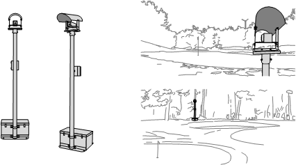
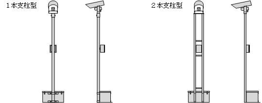
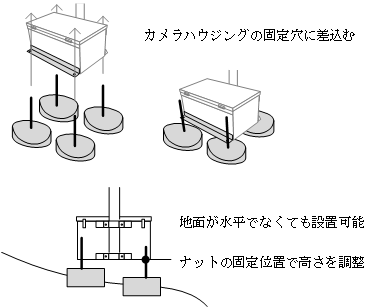

# 1. 概要

 

## 1.1. 概要

本装置はゴルフ場で、ホールインワンを証明する映像を記録するカメラシステムとします。 
プレイ及び景観に支障がないコース脇に設置し、対象プレーヤーとボールの
一連の動きが記録できるよう、グリーン後方からティーグラウンドに向けます。 
撮影は自動的に行われコース管理者やプレーヤーが都度操作を行う必要はありません。 
プレーヤーからホールインワンの申請(連絡)があった際は、
撮影された映像の回収操作を行います。

 

## 1.2. 適合基準

本装置の制作について、下記に示す関係法令および各種の技術基準に適合するものとします。
- 電気事業法
- 電気通信事業法
- 電気設備に関する技術基準
- 電気通信事業法に定める技術基準
- 電気用品取締法
- 日本工業規格(JIS)
- 日本電機工業会規格(JEM)
- その他関係法令および基準・規格

本装置に使用する材料で標準規格に定めがあるものは規格合格品を使用します。

 

## 1.3. 周囲温度

本装置は下記の条件で正常動作するものとします。
- 周囲温度 &nbsp;&nbsp; -10℃ ～ +40℃
- 相対湿度 &nbsp;&nbsp; 30%RH ～ 90%RH (結露なきこと)
- 設置場所 &nbsp;&nbsp; 屋外露天

 

## 1.4. 構成・構造

本装置は本体は、各部を収納する専用のカメラハウジングから構成されます。

項目|適用
----|----
日よけ|カメラに直射日光が差すのを防ぎます。
カメラ|イメージセンサーおよび制御機器を収納します。
操作箱|操作部および制御機器を収納します。
支柱|各部を支えます。
収納箱|蓄電池を収納します。
固定穴|カメラハウジングを専用台座に固定します。

 

 

カメラハウジングの構造は下記の通りとします。
- 外形寸法は添付図面を参照します。
- 支柱の材質は、厚さ 1.5mm のステンレス鋼板製とします。
- 日よけ・カメラ・操作箱・収納箱の材質は、厚さ 2.0mm のアルミ鋼板製とします。
- カメラと操作箱は、防雨構造 (JIS C 0920) とします。
- 収納箱は防雨構造ではなく、下面に排水穴を設ける排水構造とします。
- 操作箱の扉は横開きとし施錠可能とします。
- 収納箱は蓄電池の交換が容易に行えるよう上開きとします。

 

## 1.5. 機能・性能

### 1.5.1. カメラ

本装置が備えるカメラの機能および性能は下記の通りとします。

項目|適用
----|----
撮影素子|CMOSイメージセンサー
表示画素数|4メガピクセル
記録画素数|2560(H) x 1440(V)
フレームレート|25fps
映像圧縮方式|H.264
記録改ざん防止策|映像内日時スタンプ

- 本装置が備えるカメラで対象となるコースを撮影します。
- 映像は操作箱内の記録媒体に映像ファイルとして記録します。
- 操作箱の扉内には下記を備えるものとします。
    - 記録媒体の差込口
    - 操作画面と操作ボタン
    - インジケータ―ランプ
    - 録画ランプ
- 撮影された映像は本装置内の記録媒体に記録します。
- 記録媒体の容量が一杯になると古いファイルから上書きしていく繰返記録方式とします。
- プレーヤーからホールインワンの申請(連絡)があった際は、映像回収操作を行います。
- 撮影はゴルフコースの営業時間内(昼間)とし夜間は撮影しません。
- 撮影開始と終了の制御は、本装置の内蔵時計で自動的に判断し処理します。
- 内蔵時計は GPS 受信機能により受信した現在日時へ自動的に補正します。 
- 記録する映像には、改ざん防止のため、現在日時を付加(スタンプ)します。
- カメラは設置後でも上下左右方向へ撮影角度を自由に調整可能とします。
- 現在撮影中の映像を確認するには、外部表示装置(液晶ディスプレイ等)を接続します。

### 1.5.2. 蓄電池

本装置の電源は収納箱内の蓄電池から供電します。

項目|適用
----|----
定格電圧|+12V
定格容量|40Ah
サイクル寿命|200回以上

注) 蓄電池は上記仕様の物を2個1組で使用します。
 

- 本装置は蓄電池からの電力により一定期間連続運転を行うバッテリー駆動方式とします。
- 本装置全体が満充電状態より 7日間以上連続運転可能とします。
- 蓄電池は 7日間(目安)ごとに交換し、交換時に回収した蓄電池は再充電して使用します。
- 蓄電池の寿命は、サイクル 200回(週に1回の交換で4年)以上とします。
- 蓄電池交換は作業が容易なようコネクタの抜き差しで行えるものとします。
- コネクタは緩むことがないようロック式のものを使用します。

 

## 1.6. 設置方法

本装置の設置は可能な限り傾斜のない平らな場所が望ましいと言えます。
しかし、グリーンとティーグラウンドを確実に撮影できる位置が、
必ず設置し易い平面とは限りません。
そこで、少々傾斜があっても対応できるよう、専用台座を用います。

- 専用台座の外形寸法は添付図面を参照します。
- カメラハウジング１基につき、専用台座４個を使用します。
- 専用台座のボルト状支柱を、カメラハウジング最下部の固定穴に差し込みナットで固定します。 
このナットの固定位置で、カメラハウジングが水平になるよう調整します。

 
