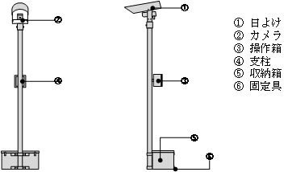
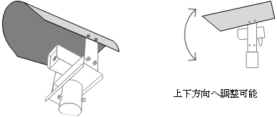
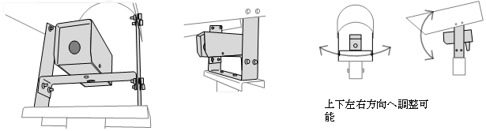
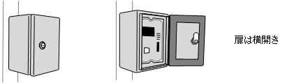
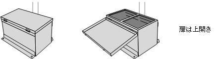
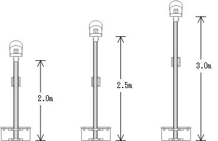
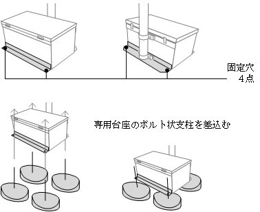

# 2. カメラハウジング

 

## 2.1. 構成

本装置の本体は、各部を収納する専用カメラハウジングとします。

項目|適用
----|----
日よけ|カメラに直接日光が差すのを防ぎます。
カメラ|イメージセンサーおよび制御機器を収納します。
操作箱|操作部および制御機器を収納します。
支柱|各部を支えます。
収納箱|蓄電池を収納します。
固定穴|カメラハウジングを専用台座に固定します。

- 外形寸法は添付図面を参照します。
- 支柱の材質は、厚さ 1.5mm のステンレス鋼板製とします。
- 日よけ・カメラ・操作箱・収納箱の材質は、厚さ 2mm のアルミ鋼板製とします。

 

## 2.2. 日よけ

カメラのカメラ窓への直射日光を極力防ぎ、
真夏の強い日差しからカメラ内の各装置を保護する「日よけ」を備えます。
「日よけ」はカメラハウジング最上部に取り付け、
設置状況に応じて角度調整が可能なものとします。

- 「日よけ」はカメラハウジング最上部に取り付けます。
- カメラ窓へ直射日光が差し込まないよう設置状況に応じて角度を調整します。
- 角度は上下方向へ３段階以上で調整可能とし、調整後はボルトで確実に固定します。

 

## 2.3. カメラ

カメラはイメージセンサーおよび制御機器を収納し、屋外露天への設置に耐えられる防雨構造とします。

- 「カメラ」はカメラハウジングの支柱の最上部へ取り付けます。
- 屋外露天での使用に耐えられる防雨構造(JIS C 0920)とします。
- 撮影向きが調整できるよう、カメラは上下左右へ向きを変えられるものとします。
- 前面にはカメラ窓を設け、これを通して撮影します。
- カメラ窓は透過のアクリル板により保護する構造とします。

 

## 2.4. 操作箱

操作箱には操作部と制御機器を収納するものとし、屋外露天への設置に耐えられる防雨とします。

- 本装置の保守作業は操作箱の扉を開き行います。
- 扉は横開きで施錠可能とします。
- 屋外露天での使用に耐えられる防雨構造(JIS C 0920)とします。
- 操作箱上部に GPS 受信装置用アンテナを備えます。

 

## 2.5. 収納箱

収納箱には本装置の電源となる畜電池を収納します。

- 畜電池の交換作業が容易なよう、上扉を開く構造とします。
- 収納箱は防雨構造ではなくと、下面に排水穴を設ける排水構造とします。
- 蓄電池は抜き差しが容易なコネクタ付きの電源線により接続します。
- 扉は閉じた状態で固定できるようパチン錠を備えます。

 

## 2.6. 支柱

本装置の各部は支柱に取り付けます。
支柱は設置場所・状況に適した長さで制作し、カメラを最適な撮影位置にできる構造とします。

- 支柱と各部のボルトにより固定する、組み立て・分解が容易な構造とします。
- 支柱長は設置する現場で調整できる構造ではなく、事前に最適な長さを調査・選択し制作します。
- 対応可能な支柱長は、2.0m、2.5m、3.0m の３種類とします。

 

## 2.7. 固定穴

本装置は固定穴で専用台座に固定します。

- 固定穴はカメラハウジングの収納箱の最下側面に設けます。
- 固定穴の数は収納箱の各部に１点ずつ計４点とします。

 