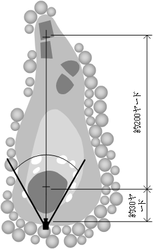

# 3. カメラ

 

## 3.1. 外観と構成

カメラはイメージセンサー等の機器を収納します。
- カメラはカメラハウジングの支柱の最上部へ取り付けます。
- 屋外露天での使用に耐えられる防雨構造(JIS C 0920)とします。
- 撮影向きが調整できるよう、上下左右へ向きを変えられるものとします。

- カメラには以下の機器を収めます。
    - イメージセンサー
    - レンズ
    - カメラ制御部
- 前面にはカメラ窓を設け、これを通して撮影します。
- カメラ窓は透過のアクリル板で保護する構造とします。

 

## 3.2. イメージセンサー

項目|適用
----|----
イメージセンサー|1/2.7インチ 5メガピクセル CMOS
表示画素数|4メガピクセル
記録画素数|2560(H) x 1440(V)

 

## 3.3. レンズ

項目|適用
----|----
マウント|CSマウント
焦点距離|f=2.8～8mm
絞り|F1.2～360相当
ズーム比|2.85倍
包括角度|2.8mm : 100.1°(水平) × 72.9°(垂直) 8mm : 35.8°(水平) × 26.8°(垂直)
操作方式|フォーカス : 手動 ズーム : 手動 アイリス : DCオートアイリス

 

## 3.4. 記録改ざん防止策

本装置で撮影した映像には、記録改ざん防止策として映像内に日時スタンプを行います。

- 日時スタンプに含まれるもの。
    - 年 (西暦4桁)
    - 月
    - 日
    - 時 (24時間制)
    - 分
    - 秒
- スタンプに用いる文字は(フォント)は、半角英数とします。
- 文字色は White とします。
- 日時は本装置が備える GPS機能により自動的に補正されます。

 

## 3.5. 撮影距離と撮影画角

本装置はホールインワンがありうるショートホールへ設置します。

- グリーンからティーグラウンドまでは、約２００ヤード程度を想定します。
- カメラからグリーンまでは、約３０ヤード程度を想定します。
- カメラはグリーンとティーグラウンドを収められる位置に配置します。

 
