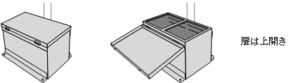
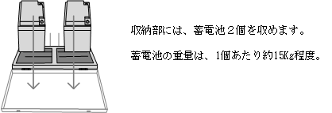
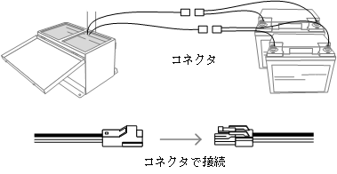
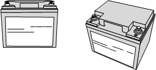
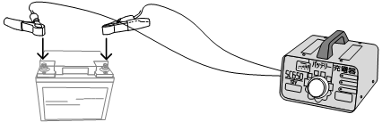

# 5. 収納箱

 

## 5.1. 外観

本装置は蓄電池を電源とします。収納箱は、この蓄電池を収納します。

- 蓄電池は収納箱の上扉を開き収めるものとします。
- 収納箱はアルミ鋼板製とし、厚さ2mmを使用するものとします。
- 収納箱は防雨構造とはせず、下面に排水穴をっ設ける排水構造とします。
- 収納箱には２個の蓄電池を収められるものとします。
蓄電池は１個あたり5Kg程度の重量となるまで分割し、運搬が容易に行えるよう考慮するものとします。

 

## 5.2. 蓄電池の接続

蓄電池はコネクタ付き２芯ケーブルで接続し、交換作業はコネクタの抜き差しで行います。

- 収納箱が防雨構造ではないため、コネクタは防滴型を使用することが望ましい。
- コネクタは緩むことがないよう、ロック式のものを使用します。

 

## 5.3. 蓄電池

蓄電池には、広い温度範囲で安定した動作が可能なものを使用します。

項目|適用
----|----
定格電圧|+12V
定格容量|40Ah
サイクル寿命|200回以上
外形寸法|197(W) x 165(D) x 170(H)mm (突起物含まず)
重量|5.9Kg

 

 

## 5.4. 蓄電池の充電

収納箱から取り出し回収した蓄電池は、充電器で充電します。

 
